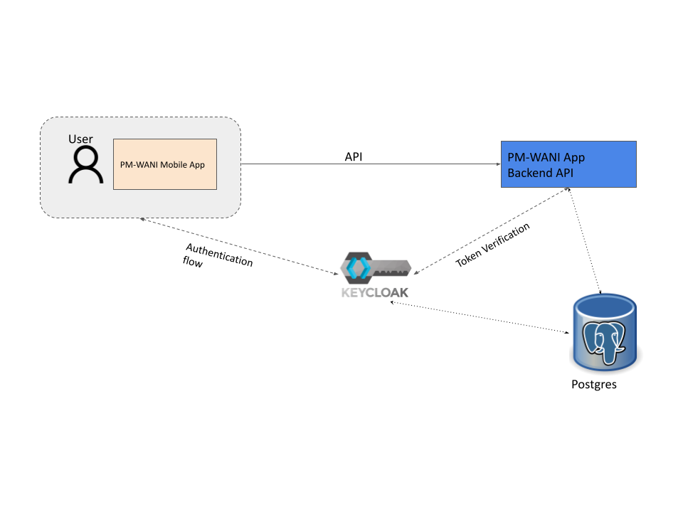

## Architecture

We are following a simple architecture for this implementation. 
### Components

** PM-WANI App ** - This is a mobile app that will be used by customers to connect to the PM-WANI compliant Access Points to access internet. Building this is out of scope for this project
** Keycloak ** - Keycloak is an open source identity and access management solution.
** Postgres ** - Database
** PM-WANI App Backend ** - The App-Provider backend following all the PM-WANI specs

